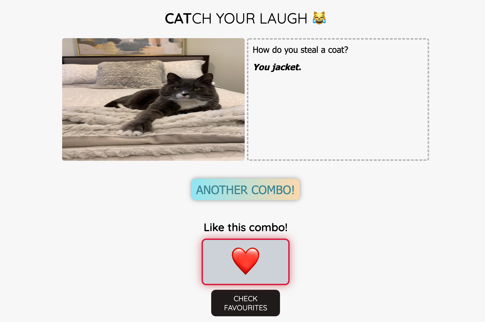
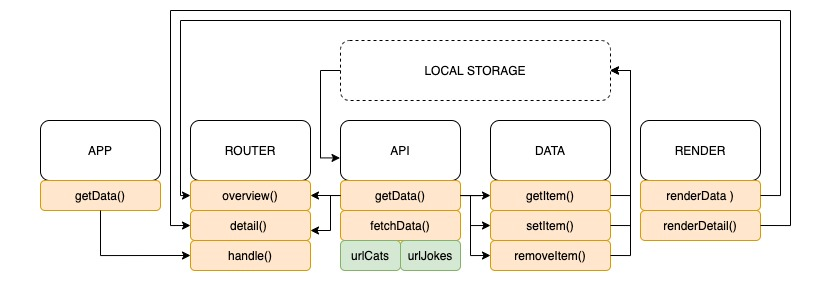
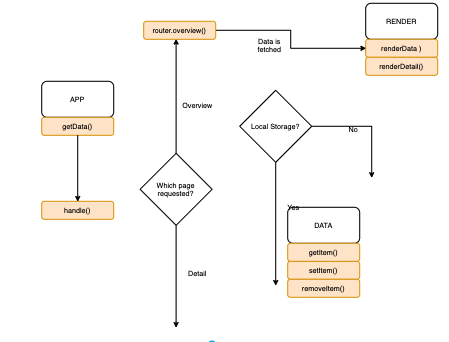

##### Web App From Scratch @cmda-minor-web 2020 - 2021

  [](https://ralfz123.github.io/web-app-from-scratch-2021) [](shields.io)

[Link to live version :rocket:](https://ralfz123.github.io/CATCH-YOUR-LAUGH/)

# **CAT**CH YOUR LAUGH
_Web App From Scratch, a course of the minor Web Design & Development. It is a minor of the third year from the study [CMD](https://www.cmd-amsterdam.nl/)._

### Table of Contents
<table style="margin-left: auto; margin-right: auto;">
    <tr>
        <td align="center"><a href="#rocket-purpose-of-project">🚀 Purpose of Project<a></td>
        <td align="center"><a href="#heart_eyes-concept">😍 Concept<a></td>
        <td align="center"><a href="#1234-data">🔢 Data<a></td>
        <td align="center"><a href="#nerd_face-technical-summary">🤓  Technical summary<a></td>
        <td align="center"><a href="#gear-installation">⚙️ Installation<a></td>
        <td align="center"><a href="#file_folder-sources">📁 Sources<a></td>
        <td align="center"><a href="#cop-license">👮 License<a></td>
    </tr> 
</table>

## :rocket: Purpose of Project
In this course I will learn to build a web application _without_ frameworks or unnecessary libraries, but with **_vanilla_ HTML**, **CSS** & **JavaScript** as much as possible. The end result is a modular, single page web app (SPA). Data will be retrieved from an external API of your choice, manipulated and finally shown in the UI of the App. I will learn different ways to structure code and develop my own coding style. With the gained knowledge I will be able to build interactive prototypes, based on real data. Also I will gain a better understanding of how API's, frameworks and libraries work.

## :heart_eyes: Concept
~ **CAT**CH YOUR LAUGH ~

**CAT**CH YOUR LAUGH is an application where you can amuse pictures of cats in combination with jokes :cat: :laughing: . You can use this app when the atmosphere is no longer good, or there is no discussion material for a while, or you just want to laugh hard. Then this is the solution! This combination will lead to endless laughter from the user! 

You may *like* the combination of the cat and the joke. It will be saved on the 'My Favourites' page and there you will see all your favourite combinations. You can also click on one of your favourites and you will be taken to the detail page where you will see your favourite in large format.


<!-- ### :bulb: Idea
 -->

### [Live version now](https://ralfz123.github.io/CATCH-YOUR-LAUGH)



#### Features
- By clicking on the 'ANOTHER COMBO' button you can see a different combination of cat and joke
- Like your favourite combination of cat and joke
- Create favourites list with your favourite combinations of cat & joke

#### Actor diagram
**Not finished yet.**


Questions:
- Have I have to handle overview and detail routes in the diagram?

#### Interaction diagram
**Not finished yet.**


## :1234: Data  
### APIs are:
1. Cat images - https://thecatapi.com/
2. Jokes - https://github.com/15Dkatz/official_joke_api

The data variables I used, are:
#### 1. Cat images
- `id`
- `url`  

#### 2. Jokes
- `id`
- `setup` 
- `punchline`

### Dataset structure
#### 1. Cat images

```js
{
    breeds: [ ],
    id: "eg4",
    url: "https://cdn2.thecatapi.com/images/eg4.jpg",
    width: 300,
    height: 225
}
```

#### 2. Jokes
```js
{
    id: 327,
    type: "general",
    setup: "Why did Sweden start painting barcodes on the sides of their battleships?",
    punchline: "So they could Scandinavian."
}
```


## :nerd_face: Technical summary
This app is built, using:
- `.map()`
- `.reduce()` (first time)
- Module patterns

<details>
<summary>To-Do's</summary>

#### App:
- [x] Data fetch (getdata)
- [x] Dynamic data via virtualDOM
- [x] FavoritesList
- [x] Like adds item (cat+joke) to favList
- [ ] Not the same combo's in the favourites list
- [x] Favourite item (detail page)
- [ ] Delete favourite item from array and rerender UI
- [x] Delete all favourites from array and rerender UI
- [ ] Redirect to detail page when clicking on unique favourite item
- [x] Data rendered in detail page (favourite item)
- [x] "Another combo" button fetches again without page reload (only invoking yet)
- [ ] UI is loaded when data is fetched
- [ ] Another section has to be to `display:none;` **when** page is loaded
- [ ] Empty state favourites UI

#### Code:
- [x] Modules
- [x] Async fetch (async await)
- [ ] Params function
- [x] Feedback (Loader) to user while fetching data
- [x] Split API-url in chunks
- [x] Routing
- [x] Script folder structure (helpers/utils/components)
- [ ] Init app and functions in a right way
- [ ] Functions/modules always have to return something in stead of invoking other functions
    - [ ] Do something based on the return of the function (fetch returns to main, in main invoke render function with data)
    - [ ] Invoking of functions in a correct way in a correct file (waterfall effect)
- [ ] Arrow function
- [x] **Map**/filter/reduce: use 1 of the 3
- [ ] Check where to use `let` or `const`
- [ ] BONUS: Templating 

##### CSS:
- [ ] custom properties colors

##### Readme:
- [x] Transform to English language
- [x] Screenshot app
- [ ] Actor Diagram
- [ ] Interaction Diagram
- [ ] Uitdagingen/learnings uitleggen

</details>

## Challenges / Inventions:
### Fetch 2 API's (Challenge)
lorem

### Modules (Challenge)
lorem
### Apply `async await` (Invention)
lorem

## :gear: Installation
1. Clone the repository:  
```
git clone https://github.com/ralfz123/CATCH-YOUR-LAUGH.git
```

2. Install dependencies   
```
npm install
```

3. To run the app   
```
python -m SimpleHTTPServer 8000  
```

4. Go to [localhost](http://localhost:8000/) in the browser
```
http://localhost:8000/
```

## :file_folder: Sources
Credits to [Joost Faber](https://github.com/joostf) && [Koop](https://github.com/KoopReynders) && Suus for giving interesting lectures about Web Apps and JavaScript and how to deal with it.

### LOREM sources
- Array.prototype.splice() - MDN. Retrieved 16 February 2021, from https://developer.mozilla.org/nl/docs/Web/JavaScript/Reference/Global_Objects/Array/splice

### Other sources
- Stackoverflow (n.d.). Searching for answers on dev questions - Stackoverflow. Retrieved 02 February 2021 from https://www.stackoverflow.com

## :cop: License
[](https://opensource.org/licenses/MIT)  
This project from [Ralf](https://github.com/ralfz123) has a [MIT © License](https://github.com/ralfz123/web-app-from-scratch-2021/blob/main/LICENSE)


<!-- Add a link to your live demo in Github Pages 🌐-->

<!-- ☝️ replace this description with a description of your own work -->

<!-- replace the code in the /docs folder with your own, so you can showcase your work with GitHub Pages 🌍 -->

<!-- Add a nice poster image here at the end of the week, showing off your shiny frontend 📸 -->

<!-- Maybe a table of contents here? 📚 -->

<!-- How about a section that describes how to install this project? 🤓 -->

<!-- ...but how does one use this project? What are its features 🤔 -->

<!-- What external data source is featured in your project and what are its properties 🌠 -->

<!-- Maybe a checklist of done stuff and stuff still on your wishlist? ✅ -->

<!-- How about a license here? 📜 (or is it a licence?) 🤷 -->

<!-- ## Program


## Learning goals

* _You can add structure to your code by applying patterns. You can defend the choice for the chosen patterns_
* _You can retrieve data, manipulate it and dynamically convert it to html elements using templating_
* _You understand how you can work with an external API using asynchronous code_
* _You understand how you can manage state in your application and you inform the user of state where necessary_

[Rubric](https://docs.google.com/spreadsheets/d/1vJJ4EhIqkefWj1nWFp0Pnvy1Kld-S2V3qwZgC6XQO0c/edit?usp=sharing), with learning goals
[Overall planning](https://teams.microsoft.com/l/file/95EAEC95-4AB8-4E62-A810-2445969460B6?tenantId=0907bb1e-21fc-476f-8843-02d09ceb59a7&fileType=xlsx&objectUrl=https%3A%2F%2Ficthva.sharepoint.com%2Fsites%2FFDMCI_EDU__CMD20_21_Minor_Web_5i7j73jt%2FShared%20Documents%2F02%20-%20Web%20App%20From%20Scratch%2FWAFS%202021%20Planning.xlsx&baseUrl=https%3A%2F%2Ficthva.sharepoint.com%2Fsites%2FFDMCI_EDU__CMD20_21_Minor_Web_5i7j73jt&serviceName=teams&threadId=19:9bd8abc7b32c4e0196ddbaae12cf8e79@thread.tacv2&groupId=5d001f9a-0a4b-4768-92b1-0f1768328ba3)


------ Program -----


### Week 1 - Hello API 🐒

Goal: Retrieve data from an API and render it in an overview page.

[Excercises](https://github.com/cmda-minor-web/web-app-from-scratch-2021/blob/master/course/week-1.md)

[Slides](https://docs.google.com/presentation/d/1hXfgIhBzJ2QXDmpKpMcx7G-a9R_fVrcPdeOyM3G0I00/edit?usp=sharing)

### Week 2 - Design and Refactor 🛠

Goal: Design the web app. Add routes and states. Split code into modules. Rendering detail page.

[Excercises](https://github.com/cmda-minor-web/web-app-from-scratch-2021/blob/master/course/week-2.md)

[Slides](https://docs.google.com/presentation/d/1ycANqFk9LtrZCBJF2TyQ1c_bejjEctSlb-52xbK_P1g/edit?usp=sharing)

### Week 3 - Wrapping up 🎁

Goal:
Manipulate data. Reflect on end result

[Excercises](https://github.com/cmda-minor-web/web-app-from-scratch-2021/blob/master/course/week-3.md)

[Slides](https://docs.google.com/presentation/d/1yZi-ODpENKHMr0-kpKmnCI6dGSgXS9oeLxMXCJnieic/edit?usp=sharing) -->

<!-- ## Best Practices
All work during this course will be tested against our [Best Practices for JavaScript](https://github.com/cmda-minor-web/best-practices/blob/master/javascript.md). -->
